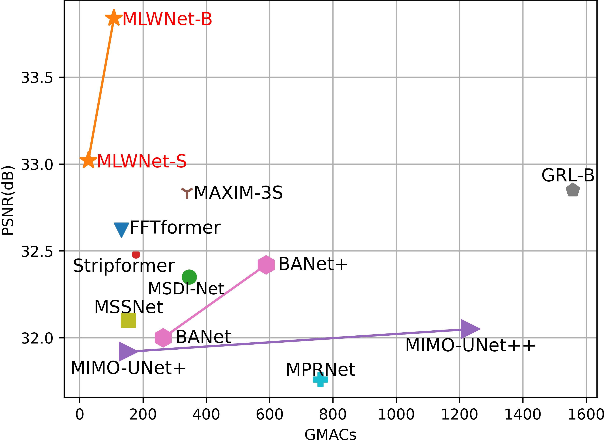

# Efficient **M**ulti-scale Network with **L**earnable Discrete **W**avelet Transform for Blind Motion Deblurring 

### News
**2024.02.28** Our Paper is accepted by **CVPR2024**.



## Easy Start


### 1.Environmental settings

```
cd MLWNet
pip install -r requirements.txt
python setup.py develop --no_cuda_ext
```

### 2.Preparing the dataset

Download the required dataset and place it under ‘./dataset' and convert it to lmdb format. In the future, we will also open a direct link to download the dataset in lmdb format.

### 3.Start  training
Take RSBlur and 8 GPUs as an example:

```
nohup python -m torch.distributed.launch --nproc_per_node=8 --master_port=4321 basicsr/train.py --opt options/train/RSBlur/MLWNet-B.yml --launcher pytorch &>MLWNet-B-RS.out&
```

### 4.Evaluation

We will be open-sourcing our pre-trained models. For RealBlur and RSBlur, please use their official alignment codes respectively.

```
python eval.py --weights your_weights --dir your_dataset --device your_device
```

### 5.Other
